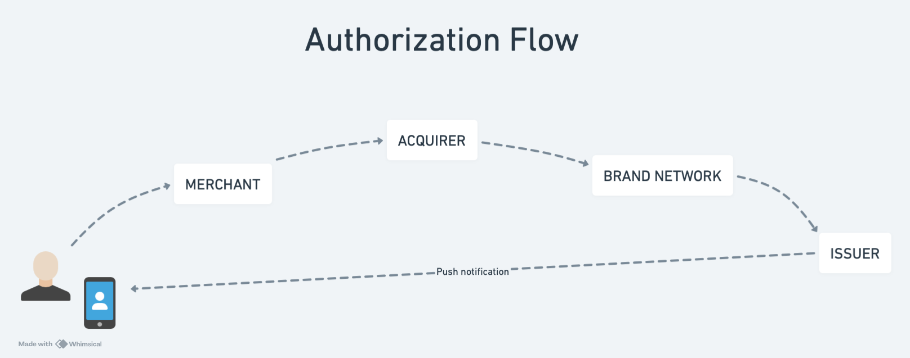
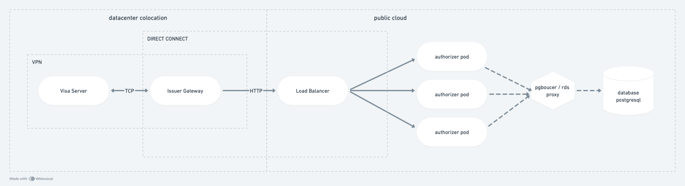
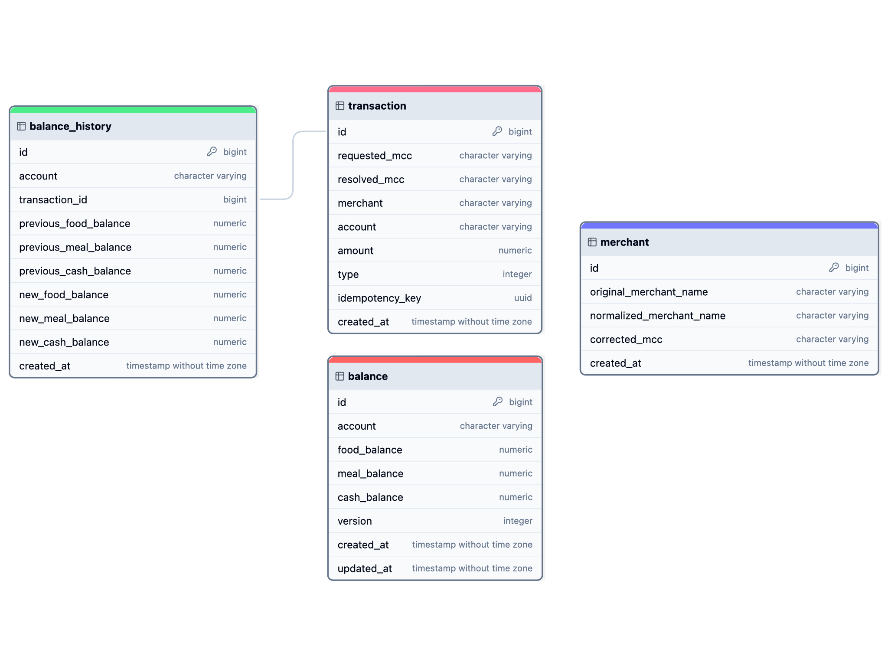

# Authorizer Design Docs

Autor: [Lucas Soares de Araujo](https://github.com/lucassoaresaraujo)

Esta proposta apresenta uma versão simplificada de um autorizador de transações com cartão de crédito, desenvolvida para o processo seletivo da Caju, utilizando a linguagem Java com o framework Spring. 

O objetivo é implementar um sistema que processe transações de maneira eficiente e segura, atendendo aos requisitos funcionais e de desempenho estabelecidos no desafio. 

A solução busca oferecer uma modelagem clara do domínio, uma organização estruturada do código e uma cobertura abrangente de testes automatizados, utilizando práticas recomendadas do ecossistema Spring para entregar um resultado robusto e escalável. Este documento detalha o design e as decisões técnicas adotadas para alcançar esses objetivos.

## Funcionamento do Fluxo de Autorização de Transações



O fluxo inicia com o cliente realizando uma compra em um estabelecimento (merchant).
Geralmente, o estabelecimento envia a solicitação de pagamento através de uma maquininha POS (Point of Sale) para o adquirente (acquirer), que é a entidade responsável por processar a transação.

O adquirente encaminha a solicitação para a bandeira do cartão (como Visa ou Mastercard), que a direciona ao banco emissor (issuer) do cartão do cliente. O banco emissor verifica os dados, a disponibilidade de saldo e responde com a aprovação ou recusa da transação, que é enviada de volta ao estabelecimento.

## Non-goals
**Desenvolvimento de Funcionalidades Avançadas:** Não foi desenvolvido tratamento de fraudes ou mecanismos mais avançados de segurança, além dos requisitos básicos de autorização e processamento de transações.


**Desenvolvimento em Scala ou Kotlin:** Apesar de ter experiência com Kotlin e grande interesse em aprender Scala, a decisão de utilizar Java e Spring foi tomada devido ao fato de que o processo seletivo poderia exigir um conhecimento mais aprofundado em Scala ou Kotlin, o que não era ideal para garantir a entrega de uma solução robusta e a capacidade de responder a questionamentos avançados em outras fases do processo.

## Visão geral da arquitetura sugerida

 

Na arquitetura sugerida, o banco emissor possui um servidor localizado em um datacenter, que mantém uma conexão direta com a bandeira do cartão de crédito. Nesse servidor, é executada uma aplicação gateway, responsável por manter uma conexão ativa com a interface da bandeira via TCP, utilizando o [formato ISO-8583](https://pt.wikipedia.org/wiki/ISO_8583).


A partir dessa conexão, o gateway redireciona a solicitação para os serviços de autorização localizados em uma nuvem pública, como a AWS, e processa a autorização em tempo real.

## Banco de dados e modelagem de dados

### Escolha do Banco de Dados

Para garantir a consistência dos dados e o cumprimento dos princípios ACID (Atomicidade, Consistência, Isolamento e Durabilidade), foi escolhido um banco de dados relacional.

A escolha do PostgreSQL baseou-se na sua confiabilidade e no forte mecanismo de ACID que oferece, além de sua capacidade de lidar com uma variedade de casos de uso complexos e suas extensas funcionalidades. 

É amplamente reconhecido que outras empresas de fintech também utilizam bancos relacionais, como o PostgreSQL, devido à sua eficácia e confiabilidade em ambientes críticos. Esses bancos de dados têm se mostrado capazes de lidar com um volume aceitável de transações mensais, reforçando sua robustez e adequação para o setor financeiro.

Além disso, caso necessário, pode-se recorer a técnicas como particionamento, proxy de pool de conexões, replica de leituras, entre outros.

### Modelagem dos dados



A modelagem escolhida é simples e um tanto desnormalizada para minimizar a quantidade de joins.

Além disso, foram criadas apenas as tabelas estritamente necessárias para o fluxo de autorização.

As entidades são:

- **balance**: responsável por manter, em tempo real, todos os saldos de uma conta. Também é utilizada com o mecanismo de lock do banco de dados para garantir que apenas uma transação seja processada por vez.

- **transaction**: responsável por manter o histórico de transações do cliente, tanto as transações de saída quanto as de entrada de saldo na conta. Isso possibilita a reconstrução, se necessário, do saldo atual do cliente.

- **balance_history**: mantém todo o histórico de saldos para cada transação, registrando o saldo anterior e o saldo posterior a cada autorização. Facilita a visualização do saldo em uma data específica, a rastreabilidade e auditoria.

- **merchant**: responsável por mapear os MCC corretos para estabelecimentos que possam estar enviando o código errado no fluxo de autorização (regra L3).

### Índices criados

Para melhorar o desempenho do uso do banco de dados foram criados os seguintes índices:

- `account` unique em `balance`, que já garante um melhor desempenhos em consultas além de manter apenas um balance por conta.  

- `idempotency_key` unique em `transaction`, que garante um melhor desepenho nas consultas e já serve como um mecanismo de proteção para permitir que uma mesma requisição seja processada duas vezes.

- `account` e `created_at` em `balance_history`, garantindo um melhor desepenho para consutas.

- `normalized_merchant_name` unique em `merchant` para melhorar o desempenho da busca textual pelo nome do estabelecimento.


## Aspectos Relevantes para um Authorizador

### Abordagens para melhorar o tempo de resposta das requisições

- Fazer o tuning da aplicação. No Spring Boot, por exemplo, pode-se configurar a quantidade de works que estarão disponíveis "na largada" . Dessa forma, evita-se que a aplicação possa demorar "aquecer".
- Distribuir a carga entre múltiplos servidores (escala horizontal) para melhorar a capacidade de resposta e a resiliência do serviço.
- Utilizar protocolos rápidos para comunicação com o autorizador, como o gRPC.
- Evitar grandes abstrações no projeto, como o JPA, e optar por uma implementação mais direta que não introduza camadas adicionais.
- Dimensionar a infraestrutura necessária de acordo com a demanda (elasticidade)
- Fazer a configuração adequada do pool de conexões da aplicação.

``` 
# Exemplo da configuração do pool do projeto que permite o fail fast para que uma requisição não passe muito tempo esperando por uma conexão com o banco de dados.
    hikari:
      auto-commit: false
      connection-timeout: 250 # Tempo máximo para esperar por uma conexão do pool de conexões: 250 milliseconds
      max-lifetime: 600000 # Tempo máximo que uma conexão do pool pode ficar aberta (10 min)
      maximum-pool-size: 20 # https://github.com/brettwooldridge/HikariCP/wiki/About-Pool-Sizing
      minimum-idle: 10
      pool-name: master

```

### Transações simultâneas

Para evitar inconsistências causadas por transações simultâneas, foi implementado um lock pessimista no `BalanceRepository`.

````
@Lock(LockModeType.PESSIMISTIC_WRITE)
@QueryHints({@QueryHint(name = "javax.persistence.lock.timeout", value = "250")}) // timeout in milliseconds to get the lock
Optional<Balance> findByAccount(String accountId);
````

**Funcionamento do Lock Pessimista:**

O lock pessimista bloqueia o acesso ao recurso (neste caso, o saldo da conta) para outras transações enquanto uma transação está em andamento. Isso garante que nenhuma outra transação possa modificar o recurso até que o lock seja liberado, evitando conflitos e garantindo a integridade dos dados.

**Vantagens:**

- **Integridade dos Dados:** Garante que a transação atual tenha acesso exclusivo ao recurso, prevenindo inconsistências.
- **Simplicidade:** É uma solução direta para problemas de concorrência, fácil de entender e implementar.

**Desvantagens:**

- **Desempenho:** Pode causar bloqueios e reduzir o desempenho em sistemas com alta concorrência, já que outros processos ficam aguardando o lock ser liberado.
- **Escalabilidade:** Não é a solução mais escalável para sistemas com grande volume de transações simultâneas, podendo levar a problemas de contenção e latência. 


**OBS**: Como o desafio relatou que a probabilidade de ocorrer 
duas transações ao mesmo tempo é pequena, optou-se pelo lock, pois teoricamente
haverá pouca probabilidade de deadlock por recursos preso.

Além disso, a transação possui um timeout definido para em caso de problemas nenhum recursos ficar preso. 


**Outras abordagens:**

- **Lock Otimista:** Caso o uso de lock pessimista não esteja adequado, pode-se considerar o uso de lock otimista, que permite múltiplas transações simultâneas e só verifica a integridade dos dados no momento do commit, reduzindo a contenção. O tradeoff desse caso é que em teremos transações negadas caso ocorra a simultaneidade, pois apenas uma será concluída.  
- **Particionamento:** Implementar particionamento de dados na tabela `balance` utilizando como chave de partição o `accountId` para dividi-la em partes menores, reduzindo a possibilidade de bloqueios simultâneos e concorrência de recursos. O particionamento pode ser feito tanto a nível de tabela do banco quanto ao nível do próprio banco, colocando contas em base de dados e cluster diferentes.
- **[CockroachDB](https://github.com/cockroachdb/cockroach):** sistema de gerenciamento de banco de dados SQL distribuido que pode ser usado para gerenciar transações com consistência distribuída e escalabilidade horizontal, oferecendo vantagens em relação a outros bancos por seu suporte nativo a locks e ACID em um ambiente altamente escalável. 

Essas abordagens podem ajudar a melhorar a escalabilidade e o desempenho do sistema, minimizando os impactos negativos do lock pessimista.

#### Teste de concorrência

Foi realizado um teste de integração para demonstrar a funcionalidade do uso de locks.

A classe [SpringBootIntegrationTest](https://github.com/lucassoaresaraujo/authorizer/blob/7c86b4774b916ae89b27db5652235db38f6b1d3b/src/test/java/com/issuingbank/authorizer/integration/SpringBootIntegrationTest.java#L29) possui o cenário onde são realizadas 10 tentativas de transações concorrentes porém só existe saldo para 5.
Dessa forma, podemos garantir que o uso do lock atende com os requisitos necessários sem trazer uma nova dependência ao projeto.

## Requisito L3: Dependente do comerciante

### Contexto e Implementação do Requisito L3

Um dos principais desafios em produtos de cartão de crédito é proporcionar clareza e contexto ao cliente sobre os estabelecimentos na fatura. Muitas vezes, o nome do merchant na fatura não corresponde ao nome fantasia do estabelecimento, o que pode levar a dúvidas e litígios relacionados a fraudes.

Dada essa preocupação, foi feita uma implementação direta para o requisito L3. A abordagem adotada consiste em normalizar o nome do merchant, removendo caracteres especiais e espaços em branco, e indexá-lo no banco de dados para uso durante a autorização.

Para essa implementação, utilizou-se o PostgreSQL, que facilitou o desenvolvimento. No entanto, outras soluções podem ser consideradas, como `Elastic Search`, `MongoDB` ou bancos em memória como o `Redis` com persistência ativada, para reduzir a latência de resposta.

### Outras Abordagens a Serem Consideradas

Para aprimorar a busca textual, técnicas de Processamento de Linguagem Natural (PLN) como [`stop words`](https://pt.wikipedia.org/wiki/Stop_word) e [`TF-IDF`](https://pt.wikipedia.org/wiki/Tf-idf) podem ser exploradas, tornando a busca mais eficiente e dinâmica. Contudo, recomenda-se realizar estudos e testes mais detalhados com várias áreas do negócio para validar a melhor abordagem.


